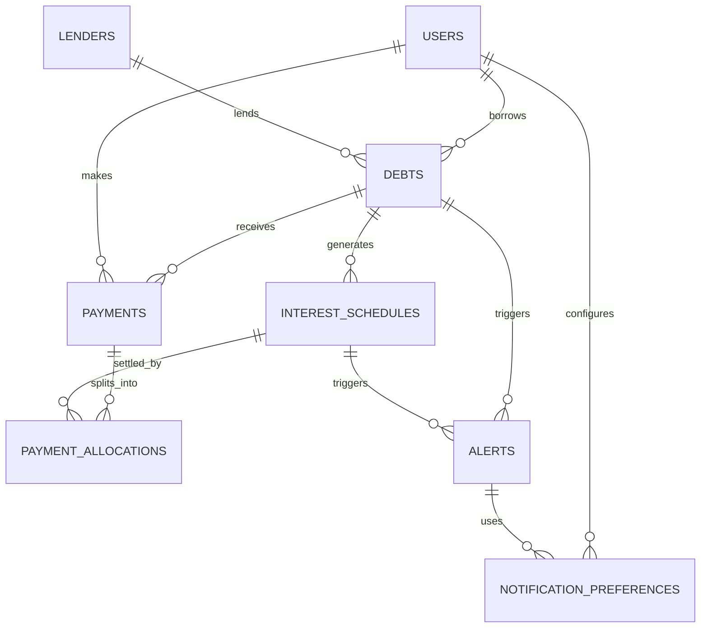

# Debt Tracker — Conceptual Entity Relationship Diagram

## Entity Descriptions

| Entity | Purpose | Key Concept |
|---|---|---|
| **USERS** | Family members who can borrow money and make payments | Borrowers and payers in the system |
| **LENDERS** | People/entities who lend money to the family | Creditors in the system |
| **DEBTS** | Individual loan agreements between a user and lender | The core business object - each debt has a principal, interest rate, and status |
| **INTEREST_SCHEDULES** | Time-based interest periods for each debt | Breaks down when interest is due (monthly, quarterly, etc.) |
| **PAYMENTS** | Actual payments made to settle debts | Records of money transferred |
| **PAYMENT_ALLOCATIONS** | How a single payment covers multiple interest periods and principal | Tracks which part of a payment goes to interest vs principal |
| **ALERTS** | Notifications about upcoming or overdue payments | Reminders sent to users based on their preferences |
| **NOTIFICATION_PREFERENCES** | User's communication settings | Controls what alerts they receive, when, and how (email/SMS/phone) |

## Relationship Summary

| Relationship | Meaning |
|---|---|
| USERS **borrow** DEBTS | A user can have multiple debts |
| LENDERS **lend** DEBTS | A lender can give multiple loans |
| DEBTS **generates** INTEREST_SCHEDULES | Each debt creates interest periods |
| DEBTS **receives** PAYMENTS | Multiple payments can settle one debt over time |
| USERS **make** PAYMENTS | Users can pay on any debt |
| PAYMENTS **split_into** PAYMENT_ALLOCATIONS | A single payment can cover multiple interest periods |
| INTEREST_SCHEDULES **settled_by** PAYMENT_ALLOCATIONS | Interest periods get paid through allocations |
| DEBTS **triggers** ALERTS | Alerts are generated for specific debts |
| INTEREST_SCHEDULES **triggers** ALERTS | Alerts tie to specific interest due dates |
| USERS **configure** NOTIFICATION_PREFERENCES | Each user controls their notification settings |
| ALERTS **use** NOTIFICATION_PREFERENCES | Alerts sent according to user preferences |

## Key Business Rules

1. **Debt Lifecycle**: A debt starts as borrowed, has interest accrue over time, receives payments, and ends when fully settled
2. **Interest Accrual**: Interest accrues on a schedule (monthly, quarterly, annually) 
3. **Payment Flexibility**: A single payment can cover multiple interest periods and reduce principal
4. **Alert Triggering**: Alerts are automatically created for upcoming and overdue payments
5. **Notification Control**: Users can configure which alerts they receive and how to receive them (email, SMS, phone)
