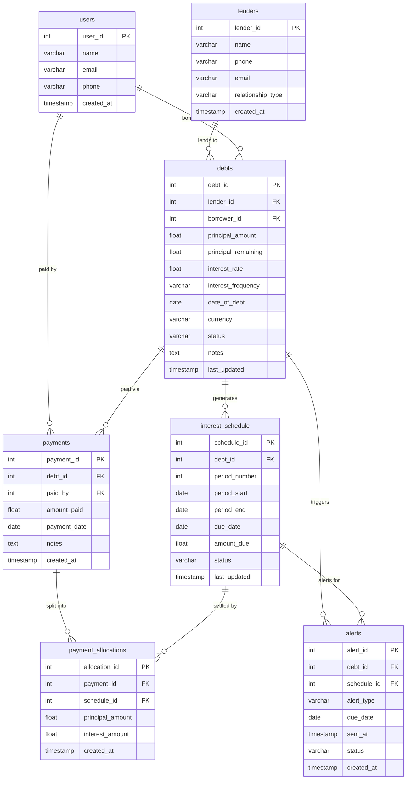

# Debt Tracker — Entity Relationship Diagram

## Relationship Notes

| Relationship | Cardinality | Why |
|---|---|---|
| lenders → debts | one-to-many | Same person can lend multiple times (e.g., Lokesh has 3 debts) |
| users → debts | one-to-many | One family member can be borrower on multiple debts |
| users → payments | one-to-many | Any family member can make a payment |
| debts → interest_schedule | one-to-many | Each debt generates one row per interest period |
| debts → payments | one-to-many | A debt can receive many payments over time |
| payments → payment_allocations | one-to-many | A single payment can partly cover interest + partly cover principal |
| interest_schedule → payment_allocations | one-to-many | A schedule period can be partially paid across multiple payments |
| debts → alerts | one-to-many | Multiple alert types per debt (due soon, overdue, milestone) |
| interest_schedule → alerts | one-to-many | Alerts tied to specific interest due dates |
